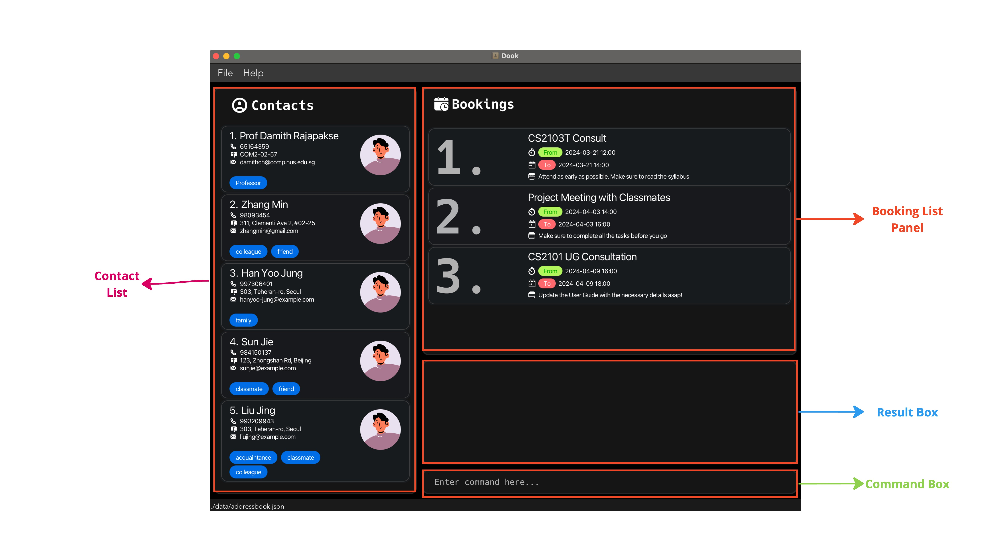
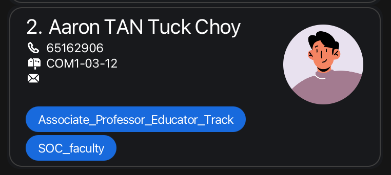
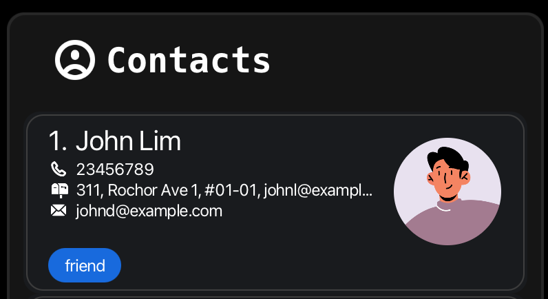
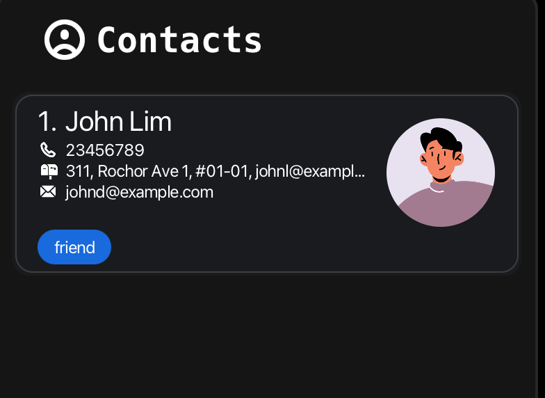
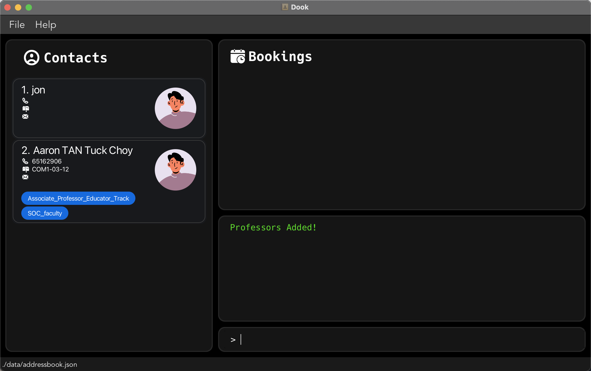
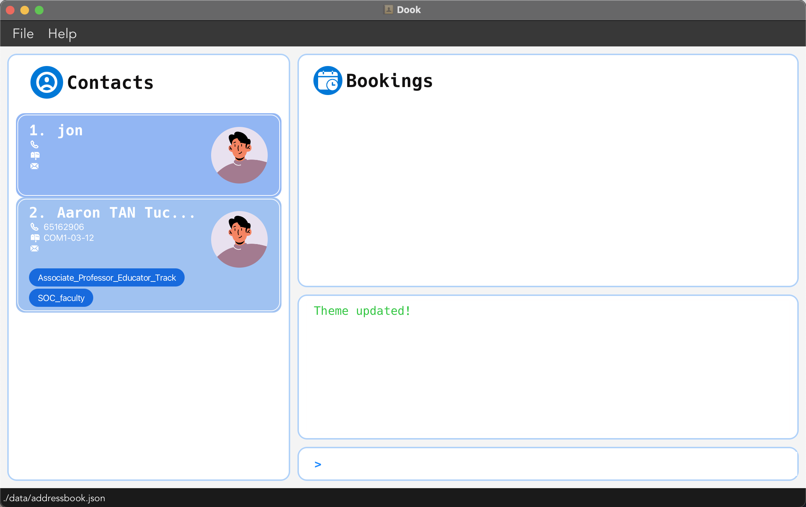
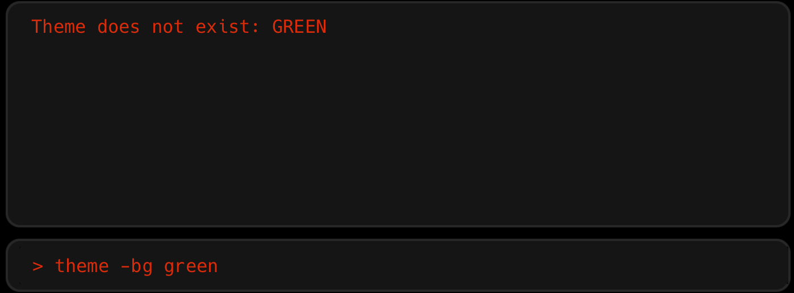

--------------------------------------------------------------------------------------------------------------------


## What is Dook?

An _elegant, minimalistic and intuitive_ **desktop application** made especially for [**NUS Computing students**](https://www.comp.nus.edu.sg/) to
easily manage their academic **consultations** and **contacts** all-in-one place.

Dook blends the power of a nimble [**Command Line Interface (CLI)**](#glossary) together with the intuitive accessibility of a
[**Graphical User Interface (GUI)**](#glossary).

Designed for the dynamic needs of the NUS
School of Computing (SoC) community, Dook centralizes faculty information
in an innovative manner, allowing one to easily find their professors by taking advantage of the basic CLI familiarity of SoC students.

For the **quick typist**, Dook elevates your ability to swiftly organize your academic consultations with professors
and teaching assistants, outpacing conventional GUI-based applications, making management of consultations a breeze.

We hope that you will find this guide helpful in maximising your Dook experience! :)

--------------------------------------------------------------------------------------------------------------------

## Using the Guide

We hope that this guide will familiarise you with the [CLI](#glossary) commands and [GUI](#glossary) and interface. If you
are unfamiliar with some jargon here, do have a quick look at our [glossary](#glossary) below! :)

* For **first-time users**, please take a look at our [Quick Start](#quick-start) section to start an end-to-end tutorial for Dook.
* For **seasoned users** who know command line and/or have used _Dook_ before, do take a look at our [Command Summary](#command-summary) for a refresher!

Throughout this guide, we also use coloured boxes to provide any important or extra pointers that we hope you would find useful.

<div markdown="block" class="alert alert-info">
:information_source: **Information**

Content in blue boxes provides additional information and contextual knowledge you need to better understand Dook.
</div>

<div markdown="block" class="alert alert-success">
:bulb: **Tips**

Content in green boxes provides tips and good practices to help you use the application more efficiently.
</div>

<div markdown="block" class="alert alert-danger">
:exclamation: **Warnings** <br>

Content in red boxes draws your attention to potential pitfalls to avoid and alert you to possible errors.
</div>

--------------------------------------------------------------------------------------------------------------------

## Table of Contents

* Table of Contents
{:toc}

--------------------------------------------------------------------------------------------------------------------

## Quick start

1. Ensure you have [Java 11](#faq) or above installed in your Computer. If you have never downloaded it before,
   download from [here.](https://www.oracle.com/sg/java/technologies/javase/jdk11-archive-downloads.html)

1. Download the latest version of [Dook](https://github.com/AY2324S2-CS2103T-W11-3/tp/releases) `jar` in your computer.

1. Copy the file into an empty folder you want to use as the `home folder` for Dook.

1. Depending on your operating system, either open “Terminal” on macOS or “Command Prompt” in Windows, and type `java -jar Dook.jar` to run the application. <br>
   
You should see a GUI similar to the one shown below pop up in a few seconds.
**Note** that the application doesn't have any sample data.

   

<div markdown="block" class="alert alert-info">
:information_source: **Information**

New to the command line? Don't worry, checkout this [guide](https://tutorials.codebar.io/command-line/introduction/tutorial.html)
</div>

### Let's add some sample data

1. First, go to the [command box](#understanding-the-interface) on the main window, where it says 
   _"Enter Command here..."_
2. Now, type `help` to open another window that lists out all the **commands** native to Dook.
3. Next, paste this command to add a **contact** named `Bob Smith` to the Dook address book. `add -n Bob Smith -p 98765432 -e bsmith@example.com -a Bedok 693021`
4. Now, let's add some sample **consultations**. Paste this in your [command box](#understanding-the-interface) to add a consultation named `CS2103T Consultation`. <br>`book -n CS2103T Consultation -s 2024-04-21 14:00 -e 2024-04-21 16:00`
5. Repeat steps 3 - 4 to add some more sample data, however this time **change** the details after each flag. (for example, `add -n Celine -p 98564383 ...`) 
6. Now, let's **find** a consultation by typing `search CS2103T Consultation` into the `command box`
7. Voila! You did it. You finally added some sample data to Dook and tried some native features as well.
8. Now, let's exit the app using `exit` command. Don't worry, you data is **automatically saved** to Dook Address Book. 


Thanks for joining us in this tutorial. For additional commands, please refer to the [Features section](#features) below for details of every available command.

[Back To Top](#table-of-contents)

--------------------------------------------------------------------------------------------------------------------

## Understanding the Interface

The main interface is divided into **two main panels** (Booking and Contact) and **4 smaller elements** (shown below). There's a menu bar at the top with two buttons `File`
 and `Help`, and at the bottom there's a status bar displaying the location of the `addressbook.json` file.

<div markdown="block" class="alert alert-info">
:information_source: **Information**

A [JSON](#glossary) file is a text-based format for storing and exchanging data. JSON stands for JavaScript Object Notation.
</div>



Here's your guide of the different panels:
1. `Contact List`: Displays all contacts in the Dook address book.
2. `Booking List`: Shows all the bookings the user currently has.
3. `Result Box`: Displays the output after each command is executed.
4. `Command Box`: Allows users to enter commands.

### Contact Card


Each `Contact card` Includes the following information:
1. `Prof Damith Rajapakse` - Contact Name
2. `65164359` - Phone Number
3. `COM2-02-57` - Address
4. `damithch@comp.nus.edu.sg` - Email
5. `Professor` - Tag 

<div markdown="block" class="alert alert-success">
:bulb: **Tips**

You can easily `add` a new contact using the [add](#adding-a-person-add) command or `update` the existing information with the [edit](#editing-a-person--edit) command.
</div>

[Back To Top](#table-of-contents)

### Booking Card


Each `Booking card` Includes the following information:
1. `CS2103T Consult` - Consultation Title
2. `2024-03-21 12:00` - Start Date and Time
3. `2024-03-21 14:00` - End Date and Time
4. `Attend as early as possible...` - Notes or Descriptions for the consultation

<div markdown="block" class="alert alert-success">
:bulb: **Tips**

You can easily `update` the following details with the [update](#editing-a-person--edit) command or [`cancel`](#cancelling-a-booking--cancel) any existing bookings immediately.
</div>

[Back To Top](#table-of-contents)

### Result Box

Displays two kinds of information/indication based on the command executed.

**Upon Success:**


**Upon Failure:**


[Back To Top](#table-of-contents)

### Help Window

Displays a window with `Command Box Panel` and `Take me to UG` link.
1. `Command Box Panel` - it consists of all the commands native to Dook.
2. `Take me to UG` - a link that takes you directly to the User Guide for more information on each feature.

<div markdown="block" class="alert alert-danger">
:exclamation: **Note** <br>
`Take me to UG` is the only time when Dook uses internet connection to take you to the User Guide. Otherwise, Dook is offline for most of its uses.
</div>


**Format:** `help`

**Instruction:**
1. Type `help` in the `Command Box` to open this window,
2. Or, press `Help` Button on the main interface.

It will open a window similar to this:


[Back To ToC](#table-of-contents)

--------------------------------------------------------------------------------------------------------------------
## Features

<div markdown="block" class="alert alert-info">

**:information_source: Notes about the command format:**<br>

* Words in `UPPER_CASE` are the parameters to be supplied by the user.<br>
  e.g. in `add -n NAME`, `NAME` is a parameter which can be used as `add -n John Doe`.

* Items in square brackets are optional.<br>
  e.g `-n NAME [-t TAG]` can be used as `-n John Doe -t friend` or as `-n John Doe`.

* Items with `…`​ after them can be used multiple times including zero times.<br>
  e.g. `[-t TAG]…​` can be used as ` ` (i.e. 0 times), `-t friend`, `-t friend -t family` etc.

* Parameters can be in any order.<br>
  e.g. if the command specifies `-n NAME -p PHONE_NUMBER`, `-p PHONE_NUMBER -n NAME` is also acceptable.

* Extraneous parameters for commands that do not take in parameters (such as `help`, `list`, `exit` and `clear`) will be ignored.<br>
  e.g. if the command specifies `help 123`, it will be interpreted as `help`.

* If you are using a PDF version of this document, be careful when copying and pasting commands that span multiple lines as space characters surrounding line-breaks may be omitted when copied over to the application.
</div>

[Back To ToC](#table-of-contents)

--------------------------------------------------------------------------------------------------------------------
### Contact Management

#### Adding a contact: `add`

**Situation:** With every contact book, we need to be able to create contacts. You have just made a new friend in your tutorial and
decided to save his contact for future collaboration purposes.

```
add -n NAME [-p PHONE_NUMBER] [-e EMAIL] [-a ADDRESS] [-t TAG…​]
```


| Param            | Remarks                                                                                                        |
|------------------|----------------------------------------------------------------------------------------------------------------|
| **NAME**         | Must be non-null and unique                                                                                    |
| **PHONE_NUMBER** | Optional, only numbers and minimum 3 digits                                                                    |
| **EMAIL**        | Optional, follow standard email formats (i.e xxx@xxx)                                                          |
| **ADDRESS**      | Optional                                                                                                       |
| **TAG**          | Optional, each tag should start with -t (i.e. for two tags `friend`, `groupmate` use `-t friend -t groupmate`) |

<div markdown="block" class="alert alert-danger">
:exclamation: **Note** <br>

Currently, Dook doesn't have the ability to recognise abbreviations (with a forward slash) such as d/o or s/o in the **_NAME_** parameter, so 
it might return an error.
</div>

<div markdown="span" class="alert alert-primary">:bulb: **Tip:**

A person can have any number of tags (including 0)
</div>

For example:
* `add -n John Doe -p 98765432 -e johnd@example.com -a John street, block 123, #01-01`
* `add -n Betsy Crowe -t friend -e betsycrowe@example.com -a Newgate Prison -p 1234567 -t criminal`

Below shows the successful output upon executing `add` command:


Below shows the contact list upon successful adding of contact:


In the event that the command entered is **invalid**, the below error message will be shown:


In the event that there is an **existing user** in the contact book, the below error message will be shown:


#### Adding a Professor

**Situation:** You have just taken CS2040S and you now have a favorite Professor in SoC! You would like to stay in contact with them and have their updated contact details at
your fingertips.

To add a specific Professor to the Dook,

```
prof -n NAME
```

| Param            | Remarks                                                |
|------------------|--------------------------------------------------------|
| **NAME**         | Must be non-null and unique (and must be from NUS SoC) |

Examples:
* `prof -n aaron`



You can also easily add all SoC staff faculty to Dook with one command:

```
prof -a
```


<div markdown="block" class="alert alert-danger">
:exclamation: **Warning** <br>

While adding all professors is included as feature, we generally advise against this. You might find adding professors individually more useful unless you decide
having the whole SoC staff faculty in your contact book is necessary!

</div>

#### Listing all contacts : `list`

**Situation:** You decided one day to touch base with all your course-mates and friends in NUS.

This command lets you easily view all the people in your contacts!

Format: `list`

Below shows the successful output upon executing `list`:


Below shows the contact list upon executing `list`:


#### Editing a contact : `edit`

**Situation:** You just had a catchup with an old friend and realised he changed his phone number because after
migrating overseas.

The command allows you to update an existing contact's details.

```
edit INDEX [-n NAME] [-p PHONE] [-e EMAIL] [-a ADDRESS] [-t TAG]…​
```

* Edits the person at the specified `INDEX`. The index refers to the index number shown in the displayed person list. The index **must be a positive integer** 1, 2, 3, …​
* **At least one** of the optional fields must be provided.
* Existing values will be updated to the input values.
* When editing tags, the existing tags of the person will be removed i.e. adding of tags is **not** cumulative.

| Param            | Remarks                                                                                                        |
|------------------|----------------------------------------------------------------------------------------------------------------|
| **INDEX**        | Must be an integer in the range [1, number of contacts displayed]                                              |
| **NAME**         | Optional                                                                                                       |
| **PHONE_NUMBER** | Optional, only numbers and minimum 3 digits                                                                    |
| **EMAIL**        | Optional, follow standard email formats (i.e xxx@xxx)                                                          |
| **ADDRESS**      | Optional                                                                                                       |
| **TAG**          | Optional, each tag should start with -t (i.e. for two tags `friend`, `groupmate` use `-t friend -t groupmate`) |

Examples:
* `edit 1 -p 91234567 -e johndoe@example.com` Edits the phone number and email address of the 1st person to be `91234567` and `johndoe@example.com` respectively.
* `edit 2 -n Betsy Crower -t` Edits the name of the 2nd person to be `Betsy Crower` and clears all existing tags.

Here is the current state of a contact information before updating:


Upon executing the command `edit 1 -n John Lim -p 23456789 -a 311, Rochor Ave 1, #01-01, johnl@example.com -t friend`,
below would be the expected output:


Here is the updated state of the contact information after updating:



<div markdown="block" class="alert alert-info">:information_source: **Information**

When editing tags, the existing tags of the person will be removed i.e adding of tags is not cumulative.

</div>

<div markdown="span" class="alert alert-success">:bulb: **Tip:**

You can remove all the person’s tags by typing `-t` without specifying any tags after it.

</div>

#### Locating contacts by name: `find`

Imagine you have just met a wonderful group of NUS students at a networking event, and you've added their details to the
contact book. A few days later, you want to send a follow-up email to one of them, but their name escapes you. You remember
it started with "John"

This command allows you to quickly retrieve all names that match, ensuring you can maintain that crucial connection without
a hitch.

Format: `find KEYWORD [MORE_KEYWORDS]`

* The search is case-insensitive. e.g `hans` will match `Hans`
* The order of the keywords does not matter. e.g. `Hans Bo` will match `Bo Hans`
* Only the name is searched.
* Only full words will be matched e.g. `Han` will not match `Hans`
* Persons matching at least one keyword will be returned (i.e. `OR` search).
  e.g. `Hans Bo` will return `Hans Gruber`, `Bo Yang`

<div markdown="block" class="alert alert-info">
:information_source: **Information**

For now, we can only `find` contacts by name - future implementations would include finding by other fields as well,
so stay tuned!
</div>

Examples:
* `find John` returns `john` and `John Doe`
* `find alex david` returns `Alex Yeoh`, `David Li`<br>

Below shows all the current contacts in our contact list, say we have 3 contacts, `John Doe`, `Peter Doe` and `Sarah Jacobs`:


Say we only want contacts with "John" in our contact list, we shall execute `find John` to achieve this.

Below shows the expected output after running the command, there is only 1 contact with `John` in their name:


Below shows the expected contact list after running the command:



<div markdown="block" class="alert alert-info">:information_source: **Information**

This command will also fetch all existing Professors in the contact book if there is a match!

</div>

#### Deleting a contact : `delete`

Your contact book is starting to look cluttered, and you realise you no longer certain contacts' details.

This command deletes the specified person from the contact book, ensuring your contacts remain relevant and up-to-date.

Format: `delete INDEX`

* Deletes the person at the specified `INDEX`.
* The index refers to the index number shown in the displayed person list.
* The index **must be a positive number** 1, 2, 3, …​

Examples:
* `list` followed by `delete 2` deletes the 2nd person in the address book.

Below shows the current state of our contact list:


Say we want to remove `Sarah Jacobs` from our contact list, as she migrated overseas to pursue her masters, and we lost contact.
We observe that she is index number **3** in our contact list. As such, we will run `delete 3` in our command box.

Below is the expected output after running `delete 3`:


Below is the expected contact list after running `delete 3`, we observe `Sarah Jacobs` no longer exists in our contact list.


<div markdown="block" class="alert alert-success">
:bulb: **Tips**

`find John` followed by `delete 1` deletes the 1st person with the name `John`.

</div>

<div markdown="block" class="alert alert-danger">

**:exclamation: Destructive Command!**<br>

This command is **irreversible**, the deleted contact information will be lost!

</div>


### Booking Management

#### Adding a booking : `book`

If you want to remind yourself of your consult tomorrow, you can add it to Dook.

```
book -n DESCRIPTION -s START_TIME -e END_TIME -note NOTE
```
* Duplicate bookings are not allowed! This means that across two bookings, you cannot have all four params to be the exact same.
* For now: start and end time formats must be in `yyyy-mm-d hh:mm` (we are working to expand this!)

| Param           | Remarks                                  |
|-----------------|------------------------------------------|
| **DESCRIPTION** | Must be non-null and unique              |
| **START_TIME**  | Must follow format of `2023-12-31 19:00` |
| **END_TIME**    | Must follow format of `2023-12-31 19:00` |
| **NOTE**        | Must be non-null                         |

Examples:
* `book -n CS2101 Consult -s 2023-12-31 19:00 -e 2023-12-31 23:00 -note DO HOMEWORK`

#### Updating bookings: `update`

Did the meeting date change? Or perhaps you want to add extra reminders in the notes? Try:
```
update INDEX -n {description} -s {start_time} -e {end_time} -note {note}
```
* The index refers to the index number shown in the displayed booking list.
* Other params are optional and entered only if you want to update current data.

| Param           | Remarks                                            |
|-----------------|----------------------------------------------------|
| **INDEX**       | Refers to currently displayed bookings             |
| **DESCRIPTION** | Optional                                           |
| **START_TIME**  | Optional, Must follow format of `2023-12-31 19:00` |
| **END_TIME**    | Optional, Must follow format of `2023-12-31 19:00` |
| **NOTE**        | Optional                                           |


#### Cancelling a booking : `cancel`

Did an appointment get cancelled or postponed? You can easily cancel bookings from the address book using:

```
cancel INDEX
```

* Deletes the booking at the specified `INDEX`.
* The index refers to the index number shown in the displayed booking list.

Examples:
* `cancel 2` cancels the 2nd booking shown in the booking list.

<div markdown="block" class="alert alert-success">
:bulb: **Tips**

You might want to use [search](###-searching-for-a-booking) to display the booking in the GUI first to easily find its INDEX.
</div>

#### Searching for a booking : `search`

Have too many bookings? Worry not, as you can searche for specific bookings using:

```
search KEYWORD [MORE_KEYWORDS]
```

* The search is case-insensitive. e.g `coNsUlT` will match `Consult`
* The order of the keywords does not matter. e.g. `consult CS2103` will match `CS2103 Consult`
* Bookings matching at least one keyword will be returned (i.e. `OR` search).
  e.g. `Consult` will return `CS2103 Consult`, `CS5300 Consult`

<div markdown="block" class="alert alert-success">
:bulb: **Tips**

Want to see all your bookings again? Try the [view command](###-searching-for-a-booking) .
</div>

#### Viewing all bookings : `view`
Done searching for your bookings with your favourite professor? Lets display all your bookings using:
```
view
```

#### Clearing all bookings entries : `cancel -a`

Want a fresh start? Quickly clears all your bookings with:

 ```
 cancel -a
 ```

<div markdown="block" class="alert alert-danger">

**:exclamation: Be careful!**<br>

This command is **irreversible**, and all your data will be lost.
Please use this command with caution!

</div>

### Other features

####  Changing themes in Dook : `theme`

Dook comes preinstalled with a light and dark theme.

Format: `theme -bg THEME` 

* Changes the current theme to either dark, light or any other theme. 
* Dark theme is the *default* on a new launch
* Dook remembers your preferences, it loads the most recent selected theme on launch.

Examples:
* `theme -bg light`

Below shows the application **before** executing `theme -bg light`:



Below shows the application **after** executing `theme -bg light`:



Below shows the error message upon executing an invalid theme: 




<div markdown="block" class="alert alert-info">:information_source: **Information**

New themes are currently being added. In v1.5, we envisioned to create a tool for users to create their own theme from the
`command box` itself.
</div>

#### Adding aliases in Dook : `alias`

For commands that you use often, Dook allows the aliasing of them to any input of your choice.

```
-al NEW_COMMAND -r COMMAND_TO_REPLACE
```

* For example, if you like swapping between themes, you can enter `-al light -r theme -bg light`
* This results in `theme -bg light` being shortened to `light`

<div markdown="block" class="alert alert-danger">
:exclamation: **Warning** <br>

**This feature is meant for advanced users, please be careful**

This feature is still in beta, note:
* Aliases **cannot** be deleted as of the current version
* Aliases must be for the entire command (i.e. cannot replace `add -n` with `addn`)
</div>


#### Exiting the program : `exit`

Exits the program.

Format: `exit`

#### Saving the data

Dook's [address book](#glossary) data are saved automatically after any command that changes the data. There is no need to save it manually.

#### Editing the data file

Dook's data is saved automatically as a [JSON](#glossary) file:<br> `[Dook JAR file location]/data/addressbook.json`. 

<div markdown="block" class="alert alert-success">
:bulb: **Tips**

**Advanced** users are welcome to update data directly by editing the json data file.
</div>

<div markdown="span" class="alert alert-warning">:exclamation: **Caution:**
If your changes to the data file makes its format invalid, Dook will discard all data and start with an empty data file at the next run. Hence, it is recommended to take a backup of the file before editing it. 

Furthermore, certain edits can cause **Dook** to behave in unexpected ways (e.g., if a value entered is outside of the acceptable range). Therefore, edit the data file only if you are confident that you can update it correctly.
</div>

--------------------------------------------------------------------------------------------------------------------

## FAQ

**Q**: How do I install Java 11?<br>
**A**: Follow this [link](https://docs.oracle.com/en/java/javase/11/install/overview-jdk-installation.html#GUID-8677A77F-231A-40F7-98B9-1FD0B48C346A) for steps to download Java 11.

**Q**: How do I transfer my data to another Computer?<br>
**A**: Go to the application's home directory and copy the `data/addressbook.json` file containing your data into the empty
data folder created by Dook on the other computer.

**Q**: Oh no! I have accidentally closed Dook without using the `exit` command? Do I lose all my data?<br>
**A**: Not to worry! Dook automatically saves all data after every change, so no data will be lost!

**Q**: Do I need Internet connection to use Dook?<br>
**A**: **Only once** when opening the User Guide using `Take me to UG` link in [Help Window](#help-window). Otherwise, Dook works fully offline!

--------------------------------------------------------------------------------------------------------------------

## Known issues

1. **When using multiple screens**, if you move the application to a secondary screen, and later switch to using only the primary screen, the GUI will open off-screen. The remedy is to delete the `preferences.json` file created by the application before running the application again.

--------------------------------------------------------------------------------------------------------------------

## Command Summary

<div markdown="block" class="alert alert-info">
:information_source: **Note:**

The list of valid commands accept **only lowercase letters**. For example, `Book` will not be accepted. Please use `book` instead.
</div>

### Address Book Command summary

| Action            | Format, Examples                                                                                                                                                                      |
|-------------------|---------------------------------------------------------------------------------------------------------------------------------------------------------------------------------------|
| **Add**           | `add -n NAME [-p PHONE_NUMBER] [-e EMAIL] [-a ADDRESS] [-t TAG]…​` <br> e.g., `add -n John Doe -p 22224444 -e jamesho@example.com -a 123, Clementi Rd, 1234665 -t friend t/colleague` |
| **Add Professor** | `prof -n NAME` or `prof -a`                                                                                                                                                           |
| **Delete**        | `delete INDEX`<br> e.g., `delete 3`                                                                                                                                                   |
| **Edit**          | `edit INDEX [-n NAME] [-p PHONE_NUMBER] [-e EMAIL] [-a ADDRESS] [-t TAG]…​`<br> e.g.,`edit 2 -n James Lee -e jameslee@example.com`                                                    |
| **Find**          | `find KEYWORD [MORE_KEYWORDS…​]`<br> e.g., `find James Jake`                                                                                                                          |
| **List**          | `list`                                                                                                                                                                                |
| **Clear**         | `clear`                                                                                                                                                                               |
| **Help**          | `help`                                                                                                                                                                                |

[Back To ToC](#table-of-contents)

### Booking List Command summary

| Action     | Format, Examples                                                                                                                     |
|------------|--------------------------------------------------------------------------------------------------------------------------------------|
| **Book**   | `book -n DESCRIPTION -s START_TIME -e END_TIME` <br> e.g., `book -n Consult with Prof Aaron -s 2024-03-01 19:00 -e 2024-03-01 23:00` |
| **View**   | `view`                                                                                                                               |
| **Update** | `update INDEX [-n DESCRIPTION] [-s START_TIME] [-e END_TIME]`<br> e.g.,`edit 2 -n Prof Aaron's Consultation -s 2024-03-01 14:30`     |
| **Search** | `search KEYWORD [MORE_KEYWORDS]`<br> e.g., `search Prof Lee's Consultation`                                                          |
| **Cancel** | `cancel INDEX` or `cancel -a`<br> e.g., `cancel 2`                                                                                   |


[Back To ToC](#table-of-contents)

## Glossary

| Term                                                                                                                                                                           | Meaning                                                                                                                                                                                                                                                                                      |
|--------------------------------------------------------------------------------------------------------------------------------------------------------------------------------|----------------------------------------------------------------------------------------------------------------------------------------------------------------------------------------------------------------------------------------------------------------------------------------------|
| **[Address Book (for Dook)](https://en.wikipedia.org/wiki/Command-line_interface)**                                                                                            | A json file that saves all the data regarding contacts and consultations.                                                                                                                                                                                                                    |
| **[CLI (Command Line Interface)](https://en.wikipedia.org/wiki/Command-line_interface)**                                                                                       | A text-based interface where users type in commands instead of interacting with the application's graphics.                                                                                                                                                                                  |
| **[CSV](https://en.wikipedia.org/wiki/Comma-separated_values)**                                                                                                                | A text file format that uses commas to separate values. It is supported by a wide range of software, including Microsoft Excel.                                                                                                                                                              |
| **[Command](https://en.wikipedia.org/wiki/Command_(computing))**                                                                                                               | A line of instructions that you input into the command box. Also see: Command Box                                                                                                                                                                                                            |
| **[Command Box](https://www.codecademy.com/articles/command-line-commands)** <a name="command-box"></a>                                                                        | A box for you to input commands.                                                                                                                                                                                                                                                             |
| **[Command Output Box](https://stackoverflow.com/questions/3038392/do-you-know-any-command-line-http-fetching-utility-like-wget)** <a name="command-output-box"></a>           | A box that displays the results of the command you keyed in. It will tell you whether the command you entered has successfully run, or if there is an error in your command that needs to be fixed. Refer to []() for a picture.                                                             |
| **[Contact List](https://support.microsoft.com/en-us/office/create-and-share-contact-groups-in-outlook-com-34a9c07e-9a4c-4ec4-a272-bc35a9c8c253)** <a name="contact-list"></a> | The Contact list is the list of contacts on the left side of the application.                                                                                                                                                                                                                |
| **[Booking List](https://www.smartsheet.com/free-excel-booking-templates)** <a name="booking-list"></a>                                                                        | The Booking list is the list of bookings on the right side of the application.                                                                                                                                                                                                               |
| **[GUI (Graphic User Interface)](https://en.wikipedia.org/wiki/Graphical_user_interface)**                                                                                     | A graphical based interface where users interact with the application's graphics like buttons or scroll panes. Also see: CLI                                                                                                                                                                 |
| **[JSON](https://www.json.org/json-en.html)**                                                                                                                                  | A JSON (JavaScript Object Notation) file is a lightweight data interchange format that's easy for humans to read and write and easy for machines to parse and generate. JSON files typically use the `.json` extension and consist of key/value pairs similar to JavaScript object literals. |
| **[Prefix](https://techterms.com/definition/prefix)**                                                                                                                          | A letter or phrase before an input.                                                                                                                                                                                                                                                          |
| **[Tag](https://en.wikipedia.org/wiki/Tag_(metadata))**                                                                                                                        | A text phrase used to categorize employees by. A tag must be either a Student, Professor, or Teaching Assistant (TA)                                                                                                                                                                         |
| **[Index](https://en.wikipedia.org/wiki/Index_(computer_science))**                                                                                                            | The number labeling each employee in the employee list.                                                                                                                                                                                                                                      |
| **[Web browser](https://www.mozilla.org/en-US/firefox/new/)**                                                                                                                  | An application to serve the web like Internet Explorer, Google Chrome, or Firefox. In fact, you are probably using one to access this guide right now!                                                                                                                                       |


[Back To ToC](#table-of-contents)
